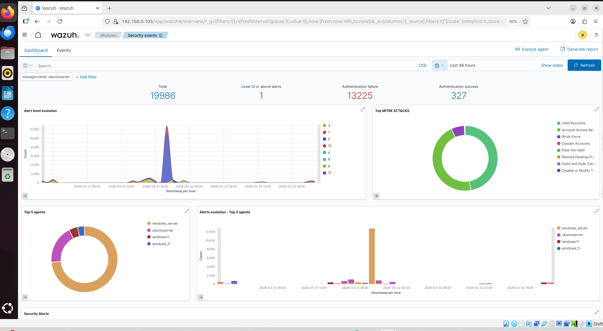
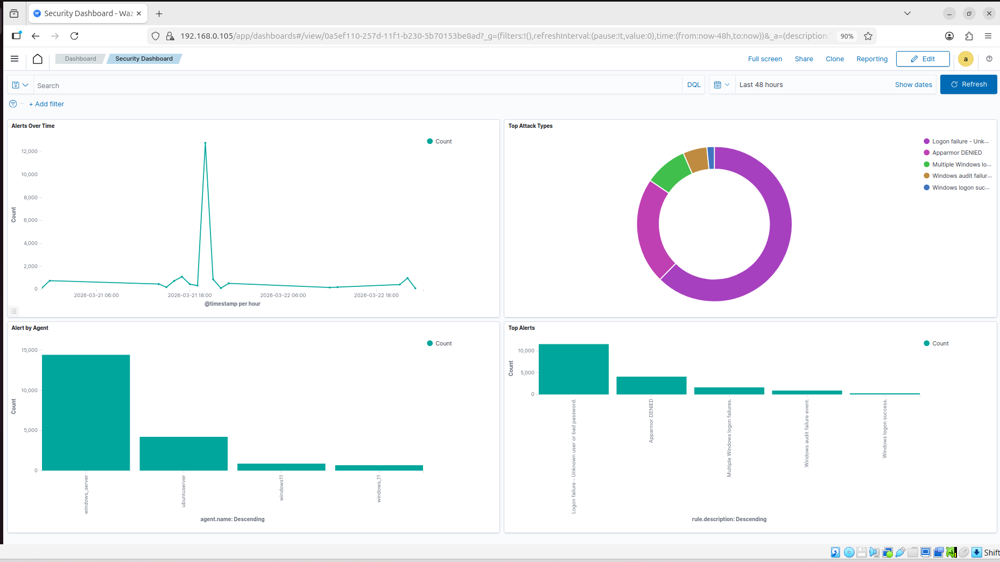
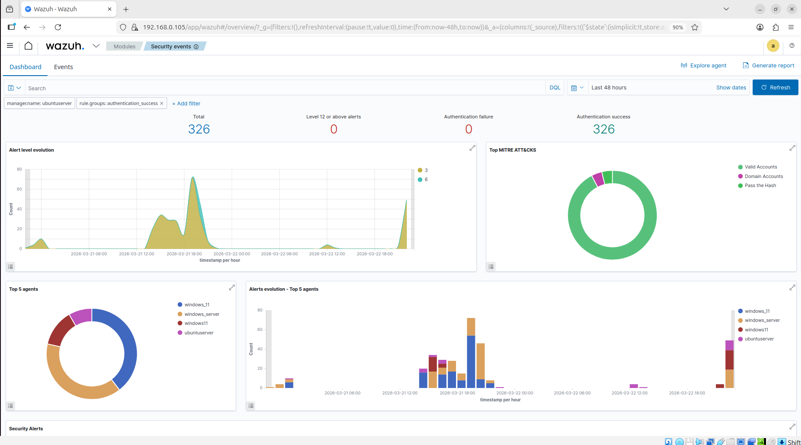
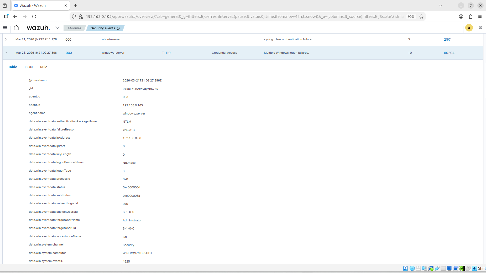

# Brute_Force_Login_Investigation
This project demonstrates detection and investigation of a brute force login attack using Wazuh SIEM. A simulated attack from Kali Linux targeted Windows systems, generating failed (4625) and successful (4624) login events. Logs were analyzed to identify attacker behavior, IP, and patterns, followed by incident reporting and mitigation steps.
# 🛡️ SOC Project using Wazuh SIEM


---



---

## 📌 Overview
This project demonstrates the implementation of a Security Operations Center (SOC) using Wazuh to monitor, detect, and analyze cyber attacks in real time.

---

## 🎯 Objective
- Simulate cyber attacks  
- Monitor system activity  
- Detect security threats  

---

## 🖥️ Lab Environment

| Machine | Role |
|--------|------|
| Kali Linux | Attacker |
| Ubuntu Server | Wazuh Manager |
| Windows Server | Target System |
| Windows 11 | Client |

---

## ⚙️ Tools Used

| Tool | Type | Main Use |
|------|------|---------|
| Hydra | Brute force | Password attacks |
| Medusa | Brute force | Faster attacks |
| CrackMapExec | Post-exploitation | Network attacks |
| NetExec (NXC) | Advanced CME | SMB exploitation |

---

## ⚔️ Attack Simulation

```bash
$ hydra -I -l Administrator -P /usr/share/wordlists/rockyou.txt smb://192.168.0.165
$ hydra -I -l Administrator -P /usr/share/wordlists/rockyou.txt rdp://192.168.0.165
$ crackmapexec smb 192.168.0.165 -u Administrator -p /usr/share/wordlists/rockyou.txt
$ medusa -h 192.168.0.165 -u Administrator -P passwords.txt -M rdp
$ nxc smb 192.168.0.165 -u Administrator -P /usr/share/wordlists/rockyou.txt --igonre-pw-decoding
```


---

## 🔍 Detection in Wazuh

### ❌ Failed Login Detection
```plaintext
win.system.eventID:4625
```

### ✅ Successful Login Detection
```plaintext
win.system.eventID:4624
```

---






---

## 🧠 Key Event IDs

| Event ID | Description |
|---------|------------|
| 4625 | Failed login |
| 4624 | Successful login |
| 4688 | Process creation |

---

## 📄 Documentation

- [Wazuh Setup](wazuh_setup_ubuntu.md)  
- [Wazuh Agent (Windows 11)](wazuh_agent_setup_windows11.md)  
- [Wazuh Agent (Windows Server)](wazuh_agent_setup_windowsserver.md)  
- [Enable Logging](enable_logging_windows11-server.md)  
- [Sysmon Setup](sysmon_setup_windows11-server.md)  
- [Attack](attack.md)  
- [Detection](detection.md)  
- [Commands](command.txt)  
- [Report](report.md)  

---

## 📊 Results

- Brute-force attack detected  
- Failed login attempts logged  
- Attacker IP identified  
- Logs visualized in dashboard  

---

## 🏁 Conclusion

Wazuh successfully detects and monitors real-time cyber attacks in a SOC environment.

---

## ⭐ Project Status

Completed Successfully
