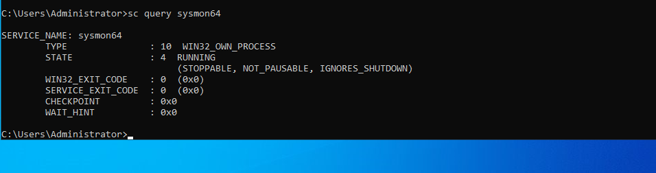

## 📊 PHASE 5 — SYSMON

## 👉 Run on BOTH Windows machines

## Download

https://download.sysinternals.com/files/Sysmon.zip

Unzip the sysmonfile

## Open CMD (Admin):

In cmd go to sysmon folder
```
$ sysmon64.exe -i
```
✅ Verify:
```
$ sc query sysmon64
```

