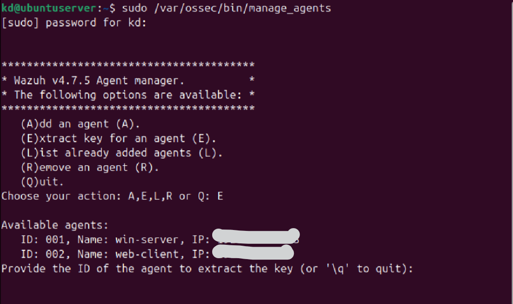

# 🔌 PHASE 3 — CONNECT WINDOWS TO WAZUH
## On Windows 11

### Install Agent 

Download:

https://packages.wazuh.com/4.x/windows/wazuh-agent-4.7.5-1.msi

from web browser

### During Install:
•	Manager IP → Ubuntu IP

•key → leave as balnk 

### Open Ubuntu Server

open Terminal

then enter this command 

```
$ sudo /var/ossec/bin/manage_agents
```

Enter A → add agent (e.g win 11)

Enter E → slecet the win 11 ID then its will shown the key 

Copy that key and add it into the wazuh agent interface



### Start Agent
Open CMD (Admin):
```
$ net start wazuh
```
### Verify in Dashboard

Go: ubuntu wazuh manager

Wazuh → Agents

👉 Status must be:

•	Active ✅
