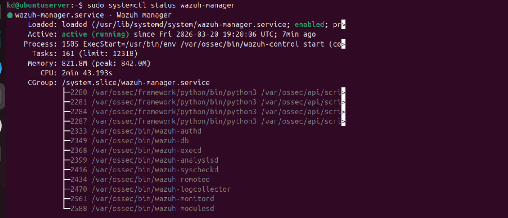

# PHASE 1: UBUNTU LAB SETUP 

## Install Wazuh

curl -sO https://packages.wazuh.com/4.7/wazuh-install.sh
```
sudo bash wazuh-install.sh -a
```
## Start Services
```
sudo systemctl start wazuh-indexer

sudo systemctl start wazuh-manager

sudo systemctl start wazuh-dashboard
```
## Enable Services
```
sudo systemctl enable wazuh-indexer

sudo systemctl enable wazuh-manager

sudo systemctl enable wazuh-dashboard
```
## Verify
```
sudo systemctl status wazuh-manager

```
### image



# PHASE 2 — ACCESS WAZUH

Open browser:

https://<UBUNTU_IP>

Login:

•	user: admin

•	password: (your set password)

